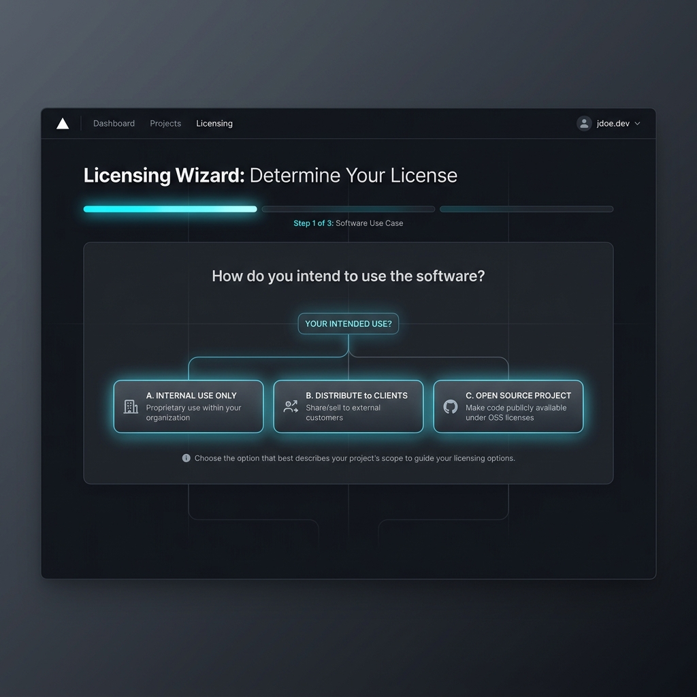
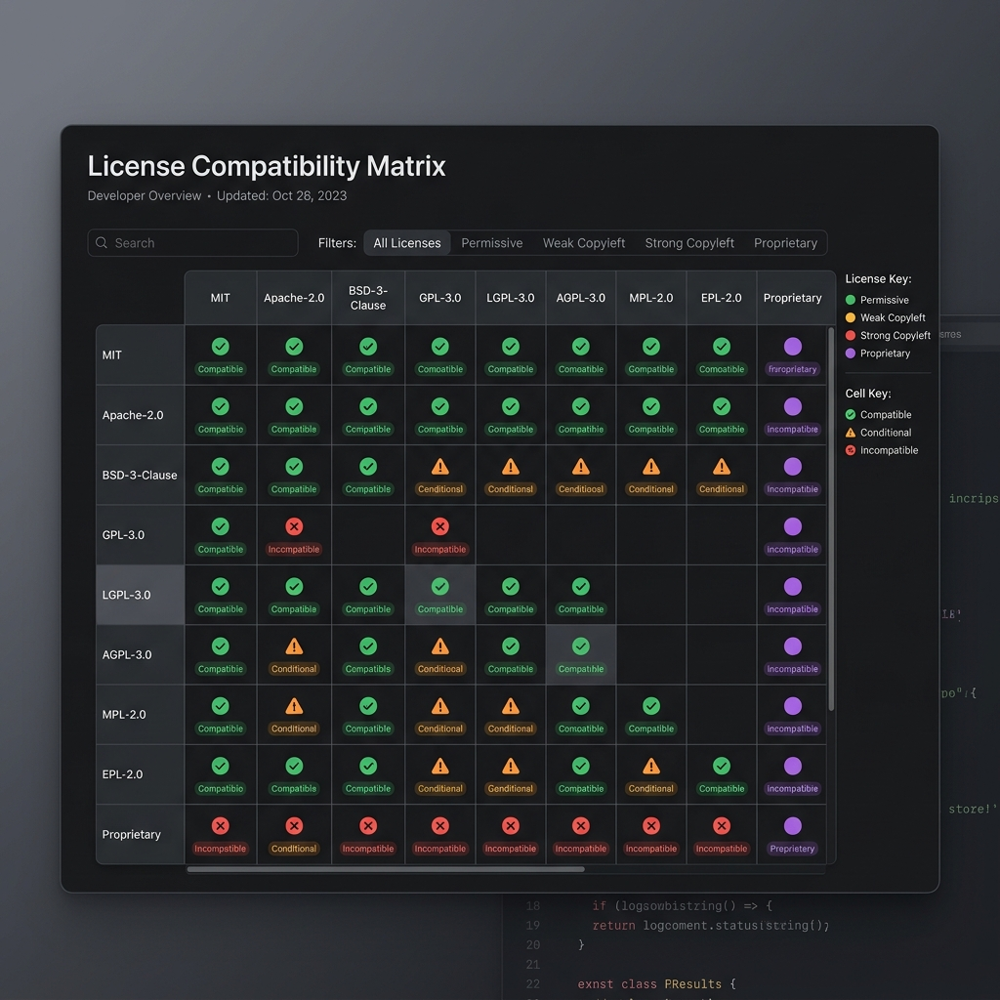

# 🔓 oss-license-helper


Stop Googling "can I use GPL in my commercial app?" — just use this.

**oss-license-helper** is a free, interactive tool that gives developers plain-English answers about open source licenses. No legal jargon. No paywalls. No confusion.

🚀 **Live tool**: [https://johanl001.github.io/oss-license-helper](https://johanl001.github.io/oss-license-helper)

---

## 🤔 Why does this exist?

Every developer has been there — you find the perfect library, but it's licensed under AGPL and you have no idea if that's a problem. You Google it. You get a Stack Overflow thread from 2011, a lawyer's blog that charges $400/hr, and a Reddit argument. You give up and use it anyway.

This tool fixes that.

---

## ✨ Features

### 1. 🌳 Decision-Tree License Checker
Answer 3 simple questions about your project:
* Is it commercial?
* Will you modify the code?
* Will you distribute it?

Get an instant, plain-English answer on whether you can use that license — and what you need to do if you can.



### 2. 📊 License Compatibility Matrix
A clear visual table showing which licenses play nicely together and which ones clash. Covers MIT, GPL-2.0, GPL-3.0, Apache 2.0, AGPL, MPL, ISC, and CC0.



### 3. ⚠️ Real-World Consequences Guide
What actually happens if you violate a license? This section cuts through the fear and explains real consequences — from a friendly email to a lawsuit — so you know what's actually at stake.

---

## 🚀 Quick Start

### Option 1 — Use it online (recommended)
Just visit 👉 [https://johanl001.github.io/oss-license-helper](https://johanl001.github.io/oss-license-helper)  
No install. No signup. Works on mobile.

### Option 2 — Run it locally
```bash
# Clone the repository
git clone https://github.com/Johanl001/oss-license-helper.git

# Navigate into the folder
cd oss-license-helper

# Open index.html in your default browser
open index.html # On macOS, or double-click index.html on Windows/Linux
```
That's it. Pure HTML — no dependencies, no build step.

---

## 📋 License Cheatsheets

Quick-reference cards for the most common licenses:

| License | Can use commercially | Must share source | Must credit author | Viral effect |
| :--- | :---: | :---: | :---: | :---: |
| **[MIT](docs/cheatsheets/mit.md)** | ✅ | ❌ | ✅ | ❌ |
| **[ISC](docs/cheatsheets/isc.md)** | ✅ | ❌ | ✅ | ❌ |
| **[CC0](docs/cheatsheets/cc0.md)** | ✅ | ❌ | ❌ | ❌ |
| **[Apache 2.0](docs/cheatsheets/apache.md)** | ✅ | ❌ | ✅ | ❌ |
| **[MPL-2.0](docs/cheatsheets/mpl.md)** | ✅ | ✅ (file-level) | ✅ | 🟡 Partial |
| **[LGPL-2.1](docs/cheatsheets/lgpl.md)** | ✅ (dynamic link) | ✅ (library only) | ✅ | 🟡 Partial |
| **[GPL-2.0](docs/cheatsheets/gpl2.md)** | ✅ | ✅ | ✅ | ✅ |
| **[GPL-3.0](docs/cheatsheets/gpl.md)** | ✅ | ✅ | ✅ | ✅ |
| **[AGPL-3.0](docs/cheatsheets/agpl.md)** | ✅ | ✅ | ✅ | ✅ (network too) |

Full cheatsheets with examples → [/docs/cheatsheets/](docs/cheatsheets/)

---

## 🗺️ Roadmap

- [x] License compatibility matrix
- [x] Decision-tree checker
- [x] Real-world consequences guide
- [x] License cheatsheet cards (MIT, ISC, Apache 2.0, GPL-2.0, GPL-3.0, AGPL, MPL-2.0, LGPL-2.1, CC0)
- [ ] GitHub repo scanner — paste a repo URL, get a license risk report
- [ ] SPDX identifier lookup
- [ ] Multi-language support (Spanish, Hindi, Portuguese)
- [ ] VS Code extension

---

## 🤝 Contributing

This project runs on community knowledge. If you spot something wrong, want to add a license, or improve the tool — please open a PR. See [CONTRIBUTING.md](file:///c:/Users/dnitr/Desktop/COLLEGE/myProjects/license-helper/CONTRIBUTING.md) to get started.

First time contributing to open source? This repo is a great place to start. Issues labelled `good first issue` are waiting for you.

---

## ⚖️ Disclaimer

This tool is for educational purposes only and is not legal advice. When in doubt about your specific situation, consult an actual lawyer.

---

## 📄 License

This project is licensed under the MIT License — see the [LICENSE](file:///c:/Users/dnitr/Desktop/COLLEGE/myProjects/license-helper/LICENSE) file for details.
