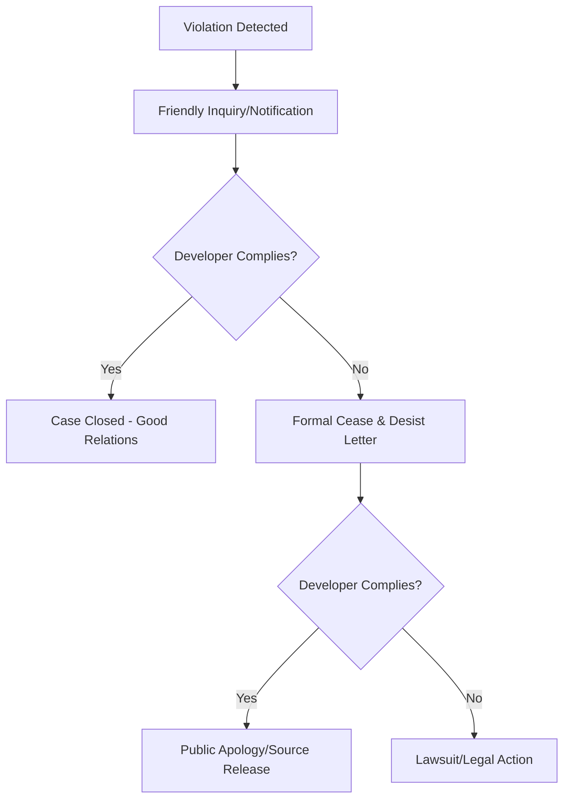

# Real-World Consequences Guide

What actually happens if you violate an open source license? Many developers operate under extreme fear of being sued immediately, while others ignore licenses entirely. The reality lies in the middle. 

Here is the real-world timeline and consequences of an open-source license violation.

---

## 1. The Enforcement Process: Step-by-Step

License compliance is rarely initiated by a lawsuit. Typically, enforcement follows a predictable path:

### Phase 1: The Alert (Friendly Notice)
*   **Who finds it?** Open-source maintainers, community compliance groups (like the Software Freedom Conservancy), or competitors scanning your app with automated tools.
*   **What happens?** You receive a polite issue, email, or pull request pointing out that you are using a copyleft dependency (e.g., GPL) in your closed-source application and asking you to comply.
*   **Action Required:** Most companies resolve the issue here by either open-sourcing the relevant parts, replacing the dependency with a permissive alternative (like MIT), or buying a commercial license from the maintainer.

### Phase 2: The Cease & Desist
*   **What happens?** If you ignore the initial friendly notices, you will receive a formal letter from a law firm representing the copyright holders. 
*   **Consequences:** Your legal team is now involved. You are ordered to stop distributing the software or making it available over the network immediately.
*   **Cost:** Legal consultation fees start accumulating (thousands of dollars).

### Phase 3: Public Exposure
*   **What happens?** The developer community becomes aware. If you refuse to comply with licensing terms, copyright holders may write blogs, share on social platforms (Hacker News, Reddit), which can damage your brand's reputation and credibility.

### Phase 4: Litigation (The Lawsuit)
*   **What happens?** A formal lawsuit is filed in federal or local court.
*   **Real Examples:** 
    *   **Versata v. Ameriprise**: Versata sued Ameriprise for using its software, but Ameriprise countersued arguing Versata used GPL software and was thus required to open source it.
    *   **Artifex v. Hancom**: Hancom (a Korean office suite creator) used Ghostscript (dual GPL/Commercial license) without paying or open-sourcing Hancom. The court ruled that GPL is a legally binding contract, and Hancom had to settle for a substantial sum.

---

## 2. Typical Outcomes / Penalties

If you are found to be in violation, courts and copyright holders usually demand one or more of the following:

1.  **Mandatory Source Code Disclosure**: You must open-source your entire proprietary project under the GPL/AGPL license. This can destroy proprietary IP.
2.  **Injunction**: You are forced to take down your application or service immediately until the violating code is completely removed.
3.  **Monetary Damages**: You must pay the copyright holders for the value of the software used, statutory damages for copyright infringement, and their legal fees.
4.  **Recalls**: If the software is embedded in physical hardware (e.g., routers, smart devices), you might have to recall or issue firmware updates for all sold devices.

---

## 3. How to Protect Your Project

To avoid these consequences, implement these simple practices:

*   **Continuous Scanning**: Use open-source dependency scanners (like FOSSA, Snyk, or Trivy) in your CI/CD pipelines to catch copyleft licenses before they reach production.
*   **Establish a Policy**: Document which licenses are pre-approved (e.g., MIT, Apache 2.0, ISC) and which ones require legal review (e.g., GPL, LGPL, AGPL).
*   **Link Carefully**: If using LGPL libraries, always link dynamically so you do not have to share your project's source code.
